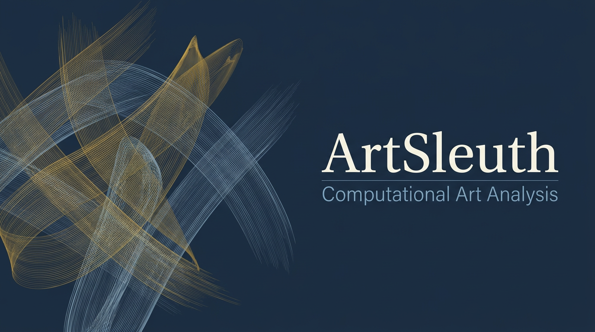
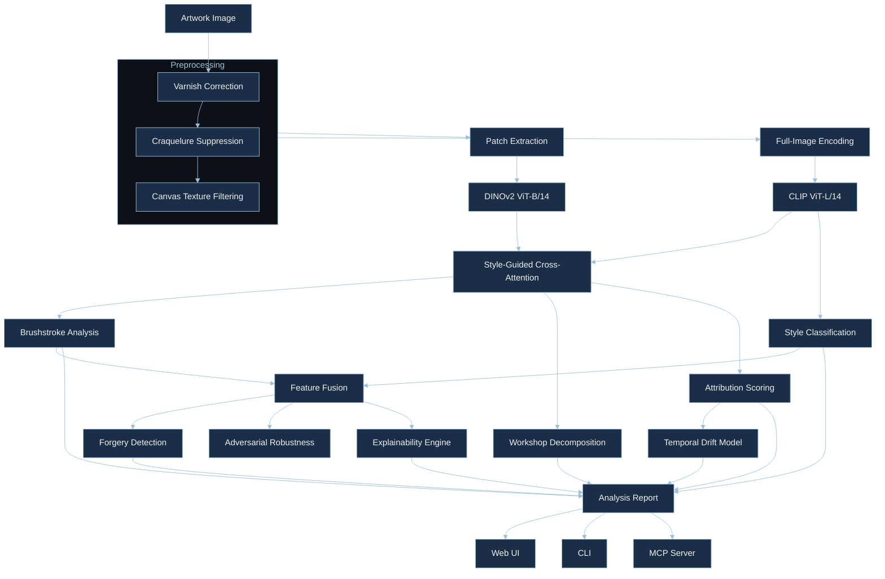

<div align="center">

<br>



<br><br>

[](https://www.python.org/)&nbsp;
[](https://pytorch.org/)&nbsp;
[](https://huggingface.co/)&nbsp;
[](https://ladyfaye1998.github.io/ArtSleuth/)&nbsp;
[](https://modelcontextprotocol.io/)&nbsp;
[](LICENSE)

<br>

[](https://github.com/ladyFaye1998/ArtSleuth)

<br>

</div>

---

<br>

### ✦ About

**ArtSleuth** is a computational art-analysis framework that formalises what connoisseurs have done for centuries — examining the physical evidence a painter leaves on a canvas — using machine learning.

Brushstroke directionality, impasto relief, palette temperature, the habitual gestures that reside in the least-scrutinised passages of a painting — drapery folds, background foliage, the rendering of earlobes. These are the signals that distinguish one hand from another, and they map naturally onto what self-supervised vision transformers learn to encode.

<br>

<div align="center">

| | Capability | Method |
|:---:|:---|:---|
|  | Stroke orientation, coherence, energy, curvature with patch-level clustering | Structure tensor decomposition via DINOv2 |
|  | Period, school, and technique prediction | CLIP embeddings through learned linear heads |
|  | Embedding-space comparison with temporal plausibility scoring | Cosine similarity with GP-based date estimation |
|  | Bayesian inference of distinct hands in collaborative paintings | Dirichlet process Gaussian mixture model |
|  | One-class anomaly scoring with adversarial robustness testing | Mahalanobis distance plus historical forgery simulation |
|  | Style-guided patch attention across dual backbones | Multi-head cross-attention (CLIP Q, DINOv2 KV) |
|  | Models how an artist's style evolves over decades | Gaussian process regression in embedding space |
|  | Visual heatmaps showing where the model looks and why | Grad-CAM and attention rollout |

</div>

<br>

---

<br>

### ✦ What's Novel

ArtSleuth introduces four contributions not found in existing art-analysis frameworks:

1. **Style-Guided Cross-Attention Fusion** — CLIP's semantic understanding directs DINOv2's patch-level attention via multi-head cross-attention with learned temperature, producing fused features neither backbone achieves alone.

2. **Temporal Style Drift Modelling** — Gaussian process regression over time-stamped reference embeddings captures how an artist's hand evolves across decades, adjusting attribution scores for temporal plausibility.

3. **Hierarchical Workshop Decomposition** — A Dirichlet process Gaussian mixture model automatically infers the number of distinct hands in a painting, replacing flat k-means with art-historically grounded probabilistic clustering.

4. **Adversarial Forgery Robustness** — Stress-tests detection against simulated historical forgery techniques (artificial aging, style transfer perturbation, material anachronism) at multiple severity levels.

<br>

---

<br>

### ✦ Quick Start

```bash
pip install artsleuth
```

<br>

**Python**

```python
import artsleuth

result = artsleuth.analyze("judith_slaying_holofernes.jpg")
print(result.summary())

explanation = result.explain()
explanation.save("analysis_overlay.png")
```

<br>

**CLI**

```bash
artsleuth analyze painting.jpg
artsleuth style painting.jpg --top-k 5
artsleuth compare painting_a.jpg painting_b.jpg
artsleuth workshop painting.jpg
artsleuth robustness painting.jpg -r "Artemisia Gentileschi"
artsleuth benchmark --backbone dinov2 --backbone fusion
artsleuth demo
```

<br>

---

<br>

### ✦ Architecture



<br>

<div align="center">

| Backbone | Strength | Used For |
|:---|:---|:---|
| **DINOv2** · ViT-B/14 | Fine-grained texture and structure (768-d) | Brushstroke analysis · cross-attention K/V |
| **CLIP** · ViT-L/14 | Semantic-stylistic understanding (768-d) | Style classification · cross-attention Q |
| **Fusion** · Cross-Attention | Style-aware structural features | Attribution · forgery · workshop decomposition |

</div>

<br>

---

<br>

### ✦ Benchmark

Linear probe and end-to-end evaluation on the full [WikiArt](https://huggingface.co/datasets/huggan/wikiart) dataset (81 444 images, 80/20 split, seed 42):

<div align="center">

| Backbone | Style Acc | Style F1 | Artist Acc | Artist Top-5 | Genre Acc |
|:---|:---:|:---:|:---:|:---:|:---:|
| DINOv2 · ViT-B/14 | 57.5 % | 0.553 | 64.7 % | 90.9 % | 71.0 % |
| CLIP · ViT-L/14 | 67.1 % | 0.656 | 74.6 % | 95.9 % | 75.0 % |
| Fusion · frozen | 65.0 % | 0.633 | 71.0 % | 94.2 % | 74.2 % |
| Fusion · fine-tuned | 71.6 % | 0.703 | 77.8 % | 96.2 % | 75.1 % |
| **Fusion · e2e** | **72.7 %** | — | **79.0 %** | **96.9 %** | **76.6 %** |

</div>

<sub>Top four rows: logistic-regression linear probes (macro-averaged across 27 styles, 129 artists, 11 genres). Bottom row: end-to-end classification heads trained jointly with the fusion backbone. Fine-tuning partially unfreezes the last 3 transformer blocks of each backbone, uses multi-task CE + supervised contrastive loss, AdamW with cosine annealing, and mixed-precision training (5 epochs, effective batch 64). Reproducible notebook on [Kaggle](https://www.kaggle.com/ladyfaye/artsleuth-sota-benchmark).</sub>

<br>

Reproduce locally:

```bash
pip install artsleuth[benchmarks]
artsleuth benchmark --device cuda --backbone-size base
```

<br>

---

<br>

### ✦ Related Work & Honest Limitations

Automated art classification has a rich history, and ArtSleuth builds on the shoulders of work we want to acknowledge properly.

<br>

**Prior art in style classification.** &ensp;Saleh & Elgammal (2016) were among the first to apply metric learning to large-scale art datasets. Tan et al. (2016) trained a ResNet-50 on WikiArt and reported ~54 % style accuracy; their subsequent ArtGAN work (Tan et al., 2018) improved this to ~58 % by leveraging generative training. Chu & Wu (2018) showed that Gram-matrix representations of neural style features could reach ~63 %. More recently, multi-phase patch-based strategies (Bani & Abu-Naser, 2023) have reported high accuracy, though typically on reduced class sets or with micro-averaged metrics that weight common styles more heavily.

**Backbone representations.** &ensp;Our fusion approach is motivated by the observation — articulated clearly in recent work on style disentanglement (Pang et al., 2025) — that self-supervised models like DINOv2 (Oquab et al., 2024) and vision-language models like CLIP (Radford et al., 2021) encode fundamentally different aspects of visual style. DINOv2 captures texture and structure; CLIP captures semantic-categorical associations. Cross-attention lets each backbone inform the other, but we should note that this idea is closely related to multi-modal fusion strategies explored in VQA and image-text retrieval.

**Workshop attribution.** &ensp;Computational connoisseurship traces back to Lyu et al. (2004), who applied wavelet statistics to distinguish Bruegel from his imitators, and to Johnson et al. (2008), who used canvas-thread analysis for Vermeer attribution. Our Dirichlet-process approach to workshop decomposition is more flexible than these hand-crafted pipelines but has not yet been validated on the expert-curated datasets those studies used.

<br>

<div align="center">

| Method | Style Acc | Artist Acc | Classes | Protocol |
|:---|:---:|:---:|:---:|:---|
| ResNet-50 (Tan et al., 2016) | 54.5 % | 56.5 % | 27 / 23 | WikiArt subset, weighted avg |
| ArtGAN (Tan et al., 2018) | 58.0 % | — | 27 | WikiArt, GAN-augmented |
| Gram matrices (Chu & Wu, 2018) | 63.0 % | — | 27 | WikiArt, micro avg |
| Deep ensemble (Manzoor et al., 2024) | 68.6 % | — | 27 | WikiArt, stacking ensemble |
| ArtFusionNet (Kose & Guner, 2025) | 99.0 % | — | 3 | WikiArt subset, 3 styles only |
| ArtSleuth Fusion · e2e | 72.7 % | 79.0 % | 27 / 129 | WikiArt full, 81k, macro avg |

</div>

<sub>Numbers are taken from the respective publications. Direct comparison is difficult: studies differ in the number of classes, dataset splits, averaging methods (micro vs. macro), and whether test sets overlap with training data. We list the protocol details we could verify so readers can judge for themselves.</sub>

<br>

**Where we fall short — and we know it.**

- **Compute-constrained training.** &ensp;Fine-tuning ran for 5 epochs on a single Tesla P100 within a 12-hour Kaggle session. More epochs, larger effective batches, or higher-VRAM GPUs (A100, H100) would very likely improve the numbers. We chose to report what we could reproduce on freely available hardware rather than extrapolate.

- **Frozen-fusion underperformance.** &ensp;Our frozen cross-attention fusion (65.0 % style) actually trails bare CLIP (67.1 %). The fusion head needs gradient signal from task labels to learn a useful alignment — it does not help out of the box. We report this rather than hide it.

- **No standardised benchmark protocol.** &ensp;WikiArt classification has no single accepted evaluation protocol. Class counts, splits, and averaging methods vary between papers, which makes apples-to-apples comparison frustratingly difficult. Our numbers use macro-averaging, which is the most conservative choice (each of the 27 styles counts equally, regardless of how many images it contains). Papers that report micro-averaged or weighted scores will appear higher on the same data.

- **Limited real-world forgery validation.** &ensp;The adversarial-robustness module simulates historical forgery techniques computationally. It has not been tested against actual forged paintings authenticated by conservators. This is a significant gap between benchmark performance and practical deployment.

- **Workshop decomposition is unsupervised.** &ensp;The Dirichlet-process model infers "hands" from embedding clusters, but there is no ground-truth labelled dataset of workshop paintings with per-region hand annotations to validate against. Art-historical validation by domain experts is still needed.

- **Temporal drift requires dated references.** &ensp;The Gaussian-process date estimator only works for artists whose dated reference embeddings are in the registry. For lesser-documented artists, the model has nothing to condition on.

We consider these open problems, not failures. Contributions that address any of them — especially expert-curated evaluation datasets — would strengthen the project considerably.

<br>

<details>
<summary>&nbsp;Full reference list</summary>

<br>

- Bani, M. & Abu-Naser, S. S. (2023). Artistic style recognition: combining deep and shallow neural networks for painting classification. *Mathematics*, 11(22), 4564.
- Blei, D. M. & Jordan, M. I. (2006). Variational inference for Dirichlet process mixtures. *Bayesian Analysis*, 1(1), 121–143.
- Caron, M. et al. (2021). Emerging properties in self-supervised vision transformers. *ICCV*.
- Chu, W.-T. & Wu, Y.-L. (2018). Image style classification based on learnt deep correlation features. *IEEE Trans. Multimedia*, 20(9), 2491–2502.
- Johnson, C. R. et al. (2008). Image processing for artist identification. *IEEE Signal Processing Magazine*, 25(4), 37–48.
- Kose, U. & Guner, B. (2025). Enhancing artistic style classification through a novel ArtFusionNet framework. *Scientific Reports*, 15, 20087. *(Note: evaluated on 3 style classes.)*
- Lyu, S., Rockmore, D. & Farid, H. (2004). A digital technique for art authentication. *PNAS*, 101(49), 17006–17010.
- Manzoor, T. et al. (2024). Deep ensemble art style recognition. *arXiv:2405.11675*.
- Oquab, M. et al. (2024). DINOv2: Learning robust visual features without supervision. *TMLR*.
- Pang, K. et al. (2025). StyleDecoupler: generalizable artistic style disentanglement. *arXiv:2601.17697*.
- Radford, A. et al. (2021). Learning transferable visual models from natural language supervision. *ICML*.
- Rasmussen, C. E. & Williams, C. K. I. (2006). *Gaussian Processes for Machine Learning*. MIT Press.
- Saleh, B. & Elgammal, A. (2016). Large-scale classification of fine-art paintings. *JOCCH*, 8(4), 1–24.
- Tan, W. R. et al. (2016). Ceci n'est pas une pipe: a deep convolutional network for fine-art paintings classification. *ICIP*.
- Tan, W. R. et al. (2018). ArtGAN: artwork synthesis with conditional categorical GANs. *ICIP*.
- Vaswani, A. et al. (2017). Attention is all you need. *NeurIPS*.

</details>

<br>

---

<br>

### ✦ Web Demo

An interactive Gradio interface with five analysis tabs: full pipeline, side-by-side comparison, workshop decomposition, temporal dating, and benchmark dashboard.

```bash
pip install artsleuth[web]
artsleuth demo
```

Or try the hosted version at [ladyfaye1998.github.io/ArtSleuth](https://ladyfaye1998.github.io/ArtSleuth/).

<br>

---

<br>

### ✦ MCP Server

ArtSleuth ships as an [MCP](https://modelcontextprotocol.io/) server, enabling AI assistants to perform art analysis conversationally.

```bash
artsleuth server
```

<br>

<div align="center">

| Tool | Description |
|:---|:---|
| `analyze_artwork` | Full analysis pipeline |
| `classify_style` | Period, school, technique classification |
| `compare_works` | Side-by-side stylistic comparison |
| `detect_anomalies` | Forgery screening against a reference corpus |

</div>

<br>

<details>
<summary>&nbsp;Claude Desktop configuration</summary>

<br>

```json
{
  "mcpServers": {
    "artsleuth": {
      "command": "artsleuth",
      "args": ["server"]
    }
  }
}
```

</details>

<br>

---

<br>

### ✦ Repository Structure

```
ArtSleuth/
├── artsleuth/
│   ├── core/                  # Analysis engines
│   │   ├── brushstroke.py     #   Brushstroke pattern extraction
│   │   ├── style.py           #   Style classification
│   │   ├── attribution.py     #   Artist attribution scoring
│   │   ├── forgery.py         #   Anomaly-based forgery detection
│   │   ├── explainability.py  #   GradCAM & attention overlays
│   │   ├── temporal.py        #   Temporal style drift (GP)
│   │   ├── workshop.py        #   Bayesian workshop decomposition
│   │   ├── adversarial.py     #   Adversarial robustness testing
│   │   └── pipeline.py        #   Unified analysis orchestrator
│   ├── models/                # Backbone & head architectures
│   │   ├── backbones.py       #   DINOv2 & CLIP loaders
│   │   ├── fusion.py          #   Cross-attention backbone fusion
│   │   ├── heads.py           #   Task-specific linear heads
│   │   └── registry.py        #   HuggingFace model registry
│   ├── preprocessing/         # Art-specific transforms
│   │   ├── transforms.py      #   Varnish, crack, canvas correction
│   │   └── patches.py         #   Grid, salient, adaptive extraction
│   ├── benchmarks/            # Evaluation suite
│   │   ├── wikiart.py         #   WikiArt dataset + linear probes
│   │   └── evaluate.py        #   Multi-backbone comparison runner
│   ├── mcp/                   # MCP server
│   │   └── server.py          #   Tool definitions & handlers
│   ├── cli/                   # Command-line interface
│   │   └── main.py            #   Click-based CLI
│   └── utils/                 # Shared utilities
│       ├── visualization.py   #   Publication-quality figures
│       └── io.py              #   Image loading & saving
├── web/                       # Gradio web demo
│   ├── app.py                 #   Main application (5 tabs)
│   ├── theme.py               #   Custom ArtSleuth theme
│   └── components.py          #   Reusable UI builders
├── tests/                     # Pytest suite (9 test modules)
├── examples/                  # Jupyter notebooks
├── docs/                      # Methodology & guides
├── assets/                    # Visual assets
└── index.html                 # GitHub Pages landing site
```

<br>

---

<br>

### ✦ Development

```bash
git clone https://github.com/ladyFaye1998/ArtSleuth.git
cd ArtSleuth
pip install -e ".[all]"

pytest
ruff check .
mypy artsleuth
```

<br>

---

<br>

### ✦ Methodology

ArtSleuth draws on two traditions:

**Art history** — Giovanni Morelli's observation (1890) that an artist's most characteristic habits reside in the least-conscious passages. Bernard Berenson's refinement of this into systematic connoisseurship. The workshop-attribution methodology developed for the Gentileschi debate, where master and assistants each contribute recognisable passages to a shared canvas.

**Computer science** — Self-supervised vision transformers (Caron et al., 2021; Oquab et al., 2024) that learn rich visual features without task-specific labels. Contrastive vision-language models (Radford et al., 2021) that ground visual concepts in linguistic semantics. Cross-attention fusion (Vaswani et al., 2017; Jose et al., 2025) for multi-modal feature alignment. Dirichlet process mixtures (Blei & Jordan, 2006) for non-parametric clustering. Gaussian processes (Rasmussen & Williams, 2006) for temporal modelling.

The two complement each other: art history provides the *questions*; machine learning provides a *scale* of analysis that would be impractical by eye alone.

See [`docs/methodology.md`](docs/methodology.md) for the full technical discussion.

<br>

---

<br>

### ✦ Citation

```bibtex
@software{lesin2026artsleuth,
  author    = {Lesin, Danielle},
  title     = {{ArtSleuth}: {AI} Art Forensics \& Analysis Framework},
  year      = {2026},
  url       = {https://github.com/ladyFaye1998/ArtSleuth},
  license   = {MIT}
}
```

<br>

---

<br>

### ✦ Contributing

Contributions are welcome from art historians, ML researchers, conservators, and anyone interested in computational approaches to cultural heritage.

<br>

<div align="center">

| Area | What's Needed |
|:---|:---|
| **Reference corpora** | Curated, well-attributed image sets for specific artists or periods |
| **Temporal references** | Dated works for training the temporal style drift model |
| **Model improvements** | Better backbones, training strategies, evaluation benchmarks |
| **Art-historical review** | Ensuring taxonomy, terminology, and methodology stay sound |
| **Web UI** | Gradio component improvements, accessibility, visualisation refinements |
| **Bug reports** | [Open an issue](https://github.com/ladyFaye1998/ArtSleuth/issues) with reproduction steps |

</div>

<br>

See [`CONTRIBUTING.md`](CONTRIBUTING.md) for guidelines.

<br>

---

<br>

<div align="center">

<sub>Built with 🫖 by <a href="https://github.com/ladyFaye1998">Danielle Lesin</a> · Where connoisseurship meets computation</sub>

<br><br>

</div>
