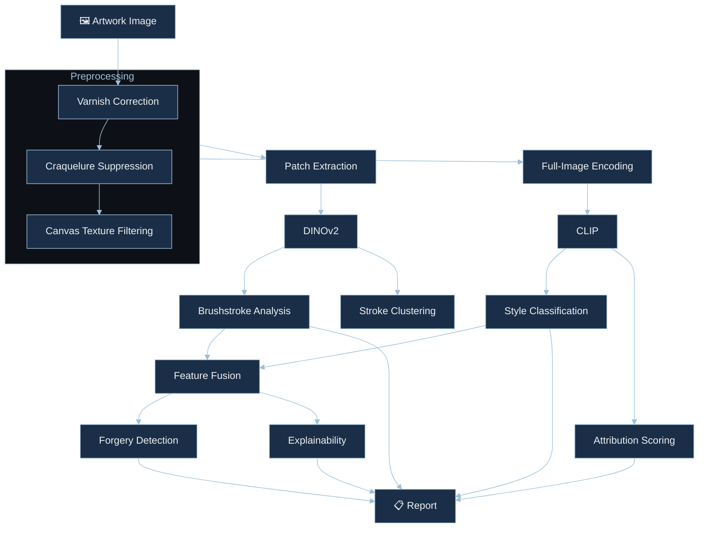

<div align="center">

<br>


<br><br>

[](https://github.com/ladyFaye1998/ArtSleuth/actions)&nbsp;
[](https://www.python.org/)&nbsp;
[](https://pytorch.org/)&nbsp;
[](https://huggingface.co/)&nbsp;
[](https://modelcontextprotocol.io/)&nbsp;
[](LICENSE)

<br>

[](https://github.com/ladyFaye1998/ArtSleuth)

<br>

</div>

---

<br>

### ✦ About

**ArtSleuth** is a computational art-analysis framework that formalises what connoisseurs have done for centuries — examining the physical evidence a painter leaves on a canvas — using machine learning.

Brushstroke directionality, impasto relief, palette temperature, the habitual gestures that reside in the least-scrutinised passages of a painting — drapery folds, background foliage, the rendering of earlobes. These are the signals that distinguish one hand from another, and they map naturally onto what self-supervised vision transformers learn to encode.

<br>

<div align="center">

| | Capability | Method |
|:---:|:---|:---|
|  | Stroke orientation, coherence, energy, curvature · patch-level clustering for multiple hands | Structure tensor decomposition via DINOv2 |
|  | Period, school, and technique prediction | CLIP embeddings · learned linear heads |
|  | Embedding-space comparison against authenticated reference works | Cosine similarity · calibrated confidence intervals |
|  | One-class anomaly scoring | Mahalanobis distance in learned feature space |
|  | Visual heatmaps showing *where* the model looks and *why* | Grad-CAM · attention rollout |

</div>

<br>

---

<br>

### ✦ Quick Start

```bash
pip install artsleuth
```

<br>

**Python**

```python
import artsleuth

result = artsleuth.analyze("judith_slaying_holofernes.jpg")
print(result.summary())

explanation = result.explain()
explanation.save("analysis_overlay.png")
```

<br>

**CLI**

```bash
artsleuth analyze painting.jpg
artsleuth style painting.jpg --top-k 5
artsleuth compare painting_a.jpg painting_b.jpg
```

<br>

---

<br>

### ✦ Architecture



<br>

<div align="center">

| Backbone | Strength | Used For |
|:---|:---|:---|
| **DINOv2** · ViT-S/14 | Fine-grained texture and structure | Brushstroke analysis · patch-level features |
| **CLIP** · ViT-B/32 | Semantic-stylistic understanding | Style classification · attribution |

</div>

<br>

---

<br>

### ✦ MCP Server

ArtSleuth ships as an [MCP](https://modelcontextprotocol.io/) server, enabling AI assistants to perform art analysis conversationally.

```bash
artsleuth server
```

<br>

<div align="center">

| Tool | Description |
|:---|:---|
| `analyze_artwork` | Full analysis pipeline |
| `classify_style` | Period, school, technique classification |
| `compare_works` | Side-by-side stylistic comparison |
| `detect_anomalies` | Forgery screening against a reference corpus |

</div>

<br>

<details>
<summary>&nbsp;Claude Desktop configuration</summary>

<br>

```json
{
  "mcpServers": {
    "artsleuth": {
      "command": "artsleuth",
      "args": ["server"]
    }
  }
}
```

</details>

<br>

---

<br>

### ✦ Repository Structure

```
ArtSleuth/
├── artsleuth/
│   ├── core/                # Analysis engines
│   │   ├── brushstroke.py   #   Brushstroke pattern extraction
│   │   ├── style.py         #   Style classification
│   │   ├── attribution.py   #   Artist attribution scoring
│   │   ├── forgery.py       #   Anomaly-based forgery detection
│   │   ├── explainability.py#   GradCAM & attention overlays
│   │   └── pipeline.py      #   Unified analysis orchestrator
│   ├── models/              # Backbone & head architectures
│   │   ├── backbones.py     #   DINOv2 & CLIP loaders
│   │   ├── heads.py         #   Task-specific linear heads
│   │   └── registry.py      #   HuggingFace model registry
│   ├── preprocessing/       # Art-specific transforms
│   │   ├── transforms.py    #   Varnish, crack, canvas correction
│   │   └── patches.py       #   Grid, salient, adaptive extraction
│   ├── mcp/                 # MCP server
│   │   └── server.py        #   Tool definitions & handlers
│   ├── cli/                 # Command-line interface
│   │   └── main.py          #   Click-based CLI
│   └── utils/               # Shared utilities
│       ├── visualization.py #   Publication-quality figures
│       └── io.py            #   Image loading & saving
├── tests/                   # Pytest suite
├── examples/                # Jupyter notebooks
├── docs/                    # Methodology & guides
└── assets/                  # Visual assets
```

<br>

---

<br>

### ✦ Development

```bash
git clone https://github.com/ladyFaye1998/ArtSleuth.git
cd ArtSleuth
pip install -e ".[dev]"

pytest
ruff check .
mypy artsleuth
```

<br>

---

<br>

### ✦ Methodology

ArtSleuth draws on two traditions:

**Art history** — Giovanni Morelli's observation (1890) that an artist's most characteristic habits reside in the least-conscious passages. Bernard Berenson's refinement of this into systematic connoisseurship. The workshop-attribution methodology developed for the Gentileschi debate, where master and assistants each contribute recognisable passages to a shared canvas.

**Computer science** — Self-supervised vision transformers (Caron et al., 2021; Oquab et al., 2024) that learn rich visual features without task-specific labels. Contrastive vision-language models (Radford et al., 2021) that ground visual concepts in linguistic semantics. One-class anomaly detection (Schölkopf et al., 2001) for identifying statistical outliers in high-dimensional feature spaces.

The two complement each other: art history provides the *questions*; machine learning provides a *scale* of analysis that would be impractical by eye alone.

See [`docs/methodology.md`](docs/methodology.md) for the full technical discussion.

<br>

---

<br>

### ✦ Citation

```bibtex
@software{lesin2026artsleuth,
  author    = {Lesin, Danielle},
  title     = {{ArtSleuth}: {AI} Art Forensics \& Analysis Framework},
  year      = {2026},
  url       = {https://github.com/ladyFaye1998/ArtSleuth},
  license   = {MIT}
}
```

<br>

---

<br>

### ✦ Contributing

Contributions are welcome from art historians, ML researchers, conservators, and anyone interested in computational approaches to cultural heritage.

<br>

<div align="center">

| Area | What's Needed |
|:---|:---|
| **Reference corpora** | Curated, well-attributed image sets for specific artists or periods |
| **Model improvements** | Better backbones, training strategies, evaluation benchmarks |
| **Art-historical review** | Ensuring taxonomy, terminology, and methodology stay sound |
| **Bug reports** | [Open an issue](https://github.com/ladyFaye1998/ArtSleuth/issues) with reproduction steps |

</div>

<br>

See [`CONTRIBUTING.md`](CONTRIBUTING.md) for guidelines.

<br>

---

<br>

<div align="center">

<sub>Built with 🫖 by <a href="https://github.com/ladyFaye1998">Danielle Lesin</a> · Where connoisseurship meets computation</sub>

<br><br>

</div>
