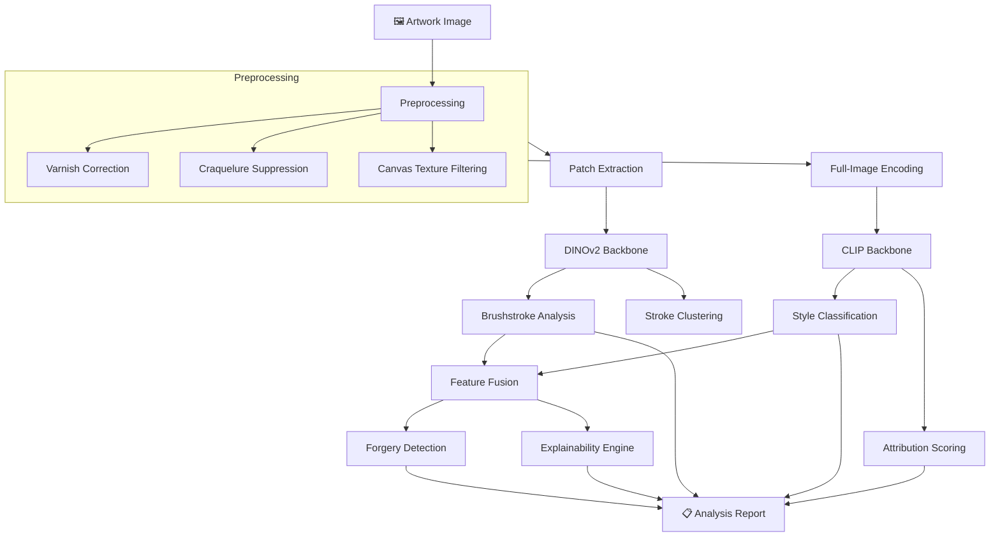

<p align="center">
  
</p>

<p align="center">
  <a href="https://github.com/ladyFaye1998/ArtSleuth/actions"></a>
  <a href="https://www.python.org/"></a>
  <a href="https://pytorch.org/"></a>
  <a href="https://huggingface.co/"></a>
  <a href="https://modelcontextprotocol.io/"></a>
  <a href="LICENSE"></a>
</p>

<p align="center">
  
</p>

---

## 👁️ What Is This?

**ArtSleuth** is a computational art-analysis framework that does what connoisseurs have done for centuries — examines the physical evidence a painter leaves on a canvas — but formalises it as machine learning.

Brushstroke directionality. Impasto relief. Palette temperature. The habitual gestures that reside in the least-scrutinised passages of a painting — drapery folds, background foliage, the rendering of earlobes. *These* are the signals that distinguish one hand from another, and they are precisely what a self-supervised vision transformer learns to encode.

ArtSleuth bridges **art history** and **deep learning** to provide:

- 🔬 **Brushstroke Analysis** — Structure-tensor decomposition of stroke orientation, coherence, energy, and curvature, with patch-level clustering to detect multiple hands.
- 🏛️ **Style Classification** — Period, school, and technique prediction via CLIP embeddings projected through learned linear heads.
- 🎨 **Artist Attribution** — Embedding-space comparison against a reference gallery of authenticated works, with calibrated confidence intervals.
- 🔍 **Forgery Detection** — One-class anomaly scoring via Mahalanobis distance in the learned feature space.
- 💡 **Explainability** — Grad-CAM and attention-rollout heatmaps overlaid at full resolution, showing *where* the model looks and *why*.

> *"A forged painting, however skilfully executed, must deviate from the statistical regularities of the artist it imitates."*

---

## ⚡ Quick Start

```bash
pip install artsleuth
```

```python
import artsleuth

result = artsleuth.analyze("judith_slaying_holofernes.jpg")
print(result.summary())

# Generate a visual explanation overlay
explanation = result.explain()
explanation.save("analysis_overlay.png")
```

**CLI:**

```bash
artsleuth analyze painting.jpg
artsleuth style painting.jpg --top-k 5
artsleuth compare painting_a.jpg painting_b.jpg
```

---

## 🏗️ Architecture



**Two backbones, two purposes:**

| Backbone | Strength | Used For |
|----------|----------|----------|
| **DINOv2** (ViT-S/14) | Fine-grained texture & structure | Brushstroke analysis, patch-level features |
| **CLIP** (ViT-B/32) | Semantic-stylistic understanding | Style classification, attribution |

---

## 🔧 MCP Server

ArtSleuth ships as an [MCP](https://modelcontextprotocol.io/) server, enabling AI assistants to perform art analysis conversationally.

```bash
artsleuth server
```

**Available tools:**

| Tool | Description |
|------|-------------|
| `analyze_artwork` | Full analysis pipeline |
| `classify_style` | Period, school, technique classification |
| `compare_works` | Side-by-side stylistic comparison |
| `detect_anomalies` | Forgery screening against a reference corpus |

**Claude Desktop configuration:**

```json
{
  "mcpServers": {
    "artsleuth": {
      "command": "artsleuth",
      "args": ["server"]
    }
  }
}
```

---

## 📂 Repository Structure

```
ArtSleuth/
├── artsleuth/
│   ├── core/                # Analysis engines
│   │   ├── brushstroke.py   #   Brushstroke pattern extraction
│   │   ├── style.py         #   Style classification
│   │   ├── attribution.py   #   Artist attribution scoring
│   │   ├── forgery.py       #   Anomaly-based forgery detection
│   │   ├── explainability.py#   GradCAM & attention overlays
│   │   └── pipeline.py      #   Unified analysis orchestrator
│   ├── models/              # Backbone & head architectures
│   │   ├── backbones.py     #   DINOv2 & CLIP loaders
│   │   ├── heads.py         #   Task-specific linear heads
│   │   └── registry.py      #   HuggingFace model registry
│   ├── preprocessing/       # Art-specific transforms
│   │   ├── transforms.py    #   Varnish, crack, canvas correction
│   │   └── patches.py       #   Grid, salient, adaptive extraction
│   ├── mcp/                 # MCP server
│   │   └── server.py        #   Tool definitions & handlers
│   ├── cli/                 # Command-line interface
│   │   └── main.py          #   Click-based CLI
│   └── utils/               # Shared utilities
│       ├── visualization.py #   Publication-quality figures
│       └── io.py            #   Image loading & saving
├── tests/                   # Pytest suite
├── examples/                # Jupyter notebooks
├── docs/                    # Methodology & guides
└── assets/                  # Visual assets
```

---

## 🧪 Development

```bash
git clone https://github.com/ladyFaye1998/ArtSleuth.git
cd ArtSleuth
pip install -e ".[dev]"

# Run tests
pytest

# Lint & type-check
ruff check .
mypy artsleuth
```

---

## 📖 Methodology

ArtSleuth's analytical framework draws on two traditions:

**From art history** — Giovanni Morelli's observation (1890) that an artist's most characteristic habits reside in the least-conscious passages. Bernard Berenson's refinement of this into systematic connoisseurship. The workshop-attribution methodology developed for the Gentileschi debate, where master and assistants each contribute recognisable passages to a shared canvas.

**From computer science** — Self-supervised vision transformers (Caron et al., 2021; Oquab et al., 2024) that learn rich visual features without task-specific labels. Contrastive vision-language models (Radford et al., 2021) that ground visual concepts in linguistic semantics. One-class anomaly detection (Schölkopf et al., 2001) for identifying statistical outliers in high-dimensional feature spaces.

The intersection is deliberate. Neither tradition alone suffices: art history provides the *questions*; machine learning provides a *scale* of analysis that no human eye can match.

For a detailed technical discussion, see [`docs/methodology.md`](docs/methodology.md).

---

## 📜 Citation

If ArtSleuth contributes to your research, please cite:

```bibtex
@software{lesin2026artsleuth,
  author    = {Lesin, Danielle},
  title     = {{ArtSleuth}: {AI} Art Forensics \& Analysis Framework},
  year      = {2026},
  url       = {https://github.com/ladyFaye1998/ArtSleuth},
  license   = {MIT}
}
```

---

## 🤝 Let's Build a Story Together

ArtSleuth is built at the intersection of disciplines that rarely share a room. If you're an art historian curious about computation, a machine-learning researcher curious about cultural heritage, or a conservator who's ever wished a neural network could tell you what it sees — this project is for you.

**Ways to contribute:**

- 🖼️ **Reference corpora** — Curated, well-attributed image sets for specific artists or periods.
- 🧠 **Model improvements** — Better backbones, training strategies, or evaluation benchmarks.
- 📝 **Art-historical grounding** — Helping the taxonomy, terminology, and methodology stay honest.
- 🐛 **Bug reports & feature requests** — [Open an issue](https://github.com/ladyFaye1998/ArtSleuth/issues).

See [`CONTRIBUTING.md`](CONTRIBUTING.md) for guidelines.

---

<p align="center">
  <sub>Built with 🫖 by <a href="https://github.com/ladyFaye1998">Danielle Lesin</a> · Where connoisseurship meets computation</sub>
</p>
